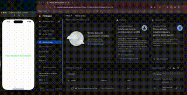

# NFCApp
This repository contains a sample iOS application. The app implements a simple iOS app that reads a remote configuration value handled by FirebaseRemoteConfiguration, depending on the value UI changes This is the base code used in following posts [Boosting iOS App Flexibility with Firebase Remote Config](https://javios.eu/swift/harnessing-nfc-technology-in-your-ios-app/) 
### Check out the app in action!  

## Requirements

- **Xcode 15.0 or later**
- **iOS 16.0 or later**
- **Swift 6.0**

